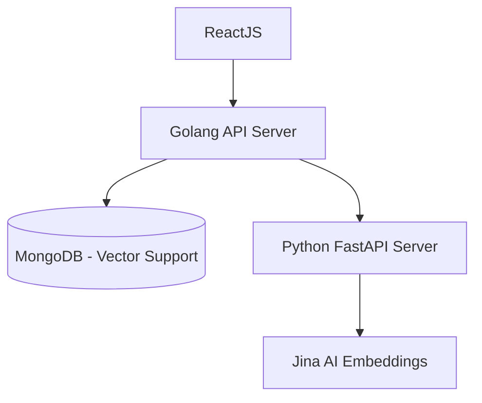

# AI Recommendation System

This is an AI-based recommendation engine for food items.

The main advantage of this system compared to a traditional recommendation system (like basic collaborative filtering or simple tag matching) is that it uses vector embeddings. By using the "jinaai/jina-embeddings-v2-base-en" model, the system actually understands the semantic meaning and context of the food descriptions and user orders, instead of just relying on exact keyword matches. This gives much more accurate and human-like recommendations.

---

## Architecture

The system is built to be a highly extendable architecture. The core backend uses Golang with Domain Driven Design (DDD) and Hexagonal Architecture principles.

- It has a clean layered structure.
- Routing is handled by `go-chi/chi`.
- Input validation uses `go-playground/validator/v10`.
- Database operations use the official MongoDB driver.

---

### System Flow



---

# Folder Structure

```
├── cmd             # Go entry points (main.go)
├── compose.yml     # Docker compose for local mongodb
├── docs            # Swagger API documentation
├── frontend        # ReactJS Vite frontend application
├── go.mod
├── go.sum
├── internal        # Core Go logic (DDD layers, handlers, repos)
└── py_backend      # FastAPI Python server for embedding generation
```

---

# Setup Instructions

First, copy the `.env.example` file in the root directory to `.env` and fill in your variables.

---

## 1. Database

You can use MongoDB Atlas cloud, but a local setup is provided via docker.

Run this from the root folder:

```bash
docker compose up -d
```

---

## 2. Python Embedding Server

This server handles the vector embeddings using FastAPI and Jina AI.

```bash
cd py_backend
pip install -r requirements.txt
uvicorn main:app --host 0.0.0.0 --port 8000
```

---

## 3. Golang API Server

This is the core recommendation engine and API gateway. Open a new terminal.

From the root of the project:
```bash
go mod tidy
# Run directly
go run cmd/api/main.go
# Or
# Build and run compiled binary
go build -o app cmd/api/main.go
./app
```

---

## 4. Frontend

The frontend is a React application built with Vite  + Pnpm. Open a new terminal.

```bash
cd frontend
pnpm install
pnpm run dev
```

(To build for production, use `pnpm run build` instead)

---

## API Documentation

Project uses Swaggo to generate the API documentation directly from the Go code. To keep this readme clean and avoid duplicating things, you can find the complete API reference (routes, DTOs, request/response formats) inside the `docs/` folder. Just serve it or import the swagger yaml/json into an editor to view all the `/food`, `/food/recommend`, and `/order/train` endpoints.
